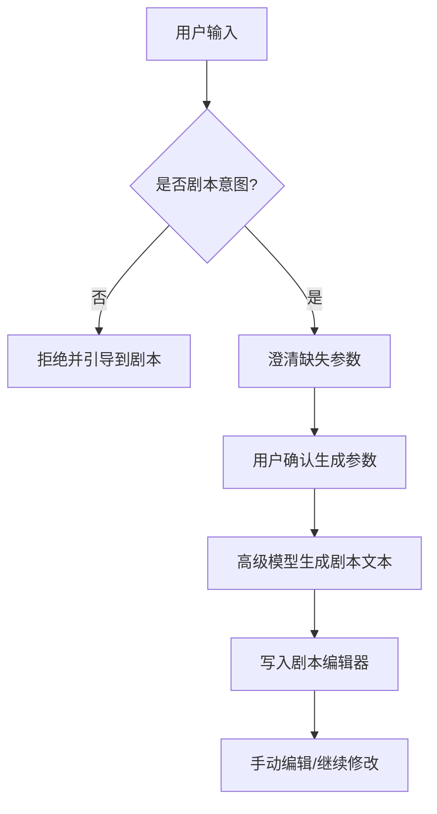
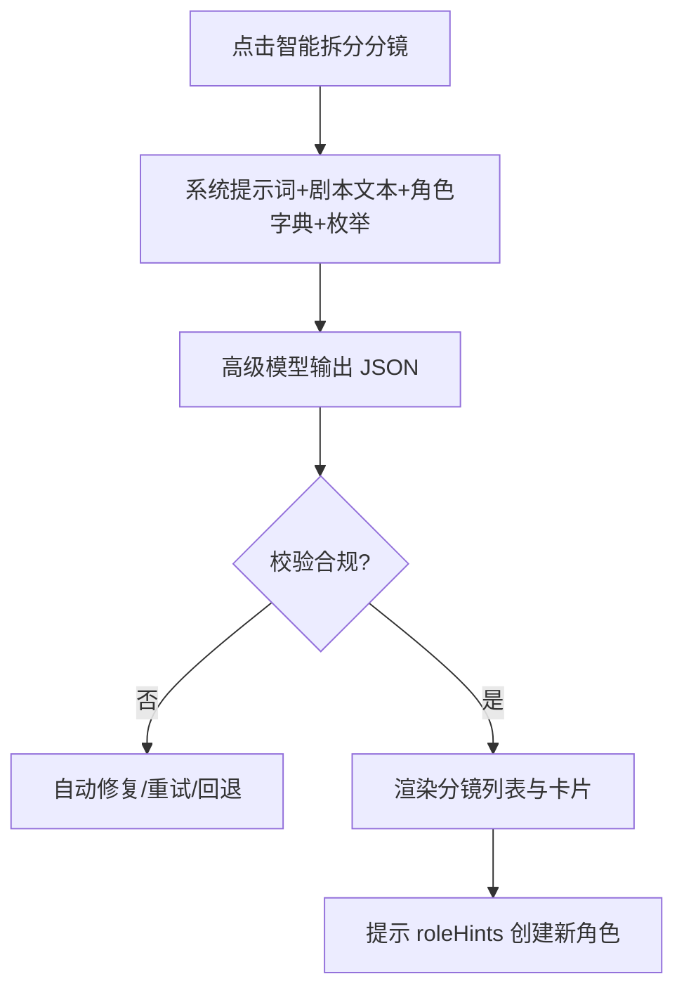
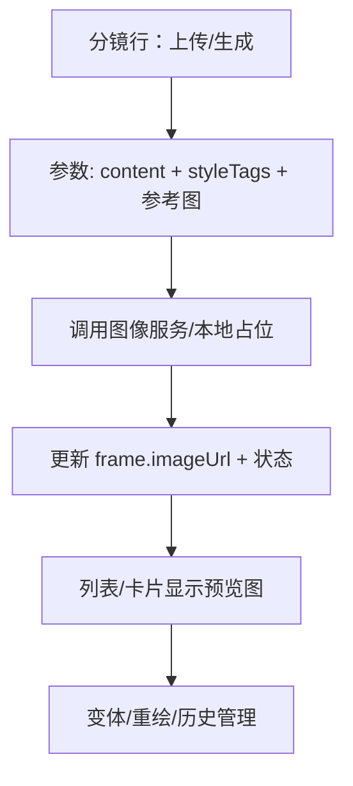

# AI 写作助手与智能拆分镜流程设计

## 目标
- 定义从“对话式剧本创作”到“结构化分镜输出”的完整工作流与边界。
- 规范提示词策略、API 契约、JSON 结构与校验，确保结果可直接渲染到当前前端视图。

## 总原则
- 写作助手只处理“剧本创作”，对非剧本类请求明确拒绝并引导。
- 流程分为三段：剧本创作 → 智能拆分镜 → 图片生成（规划中）。
- 无论剧本来源（AI 或用户粘贴），“智能拆分镜”均以当前编辑器文本为准，输出严格 JSON。

## 关键集成点
- 剧本页编辑器与按钮：`src/App.jsx:206-216`, `src/App.jsx:217-223`。
- 分镜列表/卡片渲染：`src/App.jsx:317-370`, `src/App.jsx:371-400`。
- 列顺序（预览图 → 图片描述 → 台词/音效 → 运镜 → 景别 → 角度 → 时长）：`src/App.jsx:320-333`。

---

## 流程一：剧本创作（对话式）

### 系统提示词（固定）
- 角色定位：你是一名资深分镜编剧与导演助理，只处理剧本创作。
- 边界：拒绝与剧本无关的请求；仅输出剧本文本，不输出分镜或解释。
- 语言：中文；保持风格一致性与角色命名统一。

### 会话策略
- 意图判定：若非剧本类意图，输出拒绝与引导。
- 澄清参数：题材/风格、目标镜头数或总时长、主要角色（从角色页读取）、叙事基调、语言。
- 用户确认：展示汇总参数并要求“确认生成”。
- 生成：使用高级模型（温度 0.3–0.5）生成完整剧本文本。
- 落库：将剧本文本写入编辑器；保留“手动编辑”入口，支持用户直接粘贴与修改。

### API 契约
- 请求：
```json
{
  "project": { "genre": "黑色电影", "styleTags": ["写实"], "language": "zh-CN" },
  "constraints": { "targetShots": 20, "targetDurationSec": 120 },
  "roles": [{ "name": "杀手", "summary": "冷酷、黑雨衣" }],
  "intent": "writeScript",
  "userBrief": "雨夜便利店，杀手与店员的短篇。"
}
```
- 响应（仅文本）：
```json
{ "scriptText": "《雨夜便利店》...（整篇剧本文字）" }
```

### 流程图（剧本创作）


---

## 流程二：智能拆分镜（结构化 JSON）

### 系统提示词（固定）
- 目标：将“剧本文本”拆解为结构化分镜数组；返回严格 JSON。
- 角色绑定：使用角色页已设定的角色；新角色标记“待定”，并提供设定建议。
- 枚举约束：
  - 运镜：推/拉/摇/移/固定
  - 景别：远景/中景/近景/特写
  - 角度：仰视/俯视/平视/过肩/顶视
- 画面描述：仅描述屏幕可见内容（主体、构图、光线、动作、情绪、风格），用于后续文生图。
- 语言：中文；不返回解释文本。

### JSON Schema（示意）
```json
{
  "frames": [
    {
      "id": "string",
      "scene": "1",
      "character": "杀手, 店员",
      "imageUrl": "",
      "content": "雨夜街道，霓虹反射，黑雨衣男子独行...",
      "dialogue": "旁白：在这座城市，秘密比雨水还要多。",
      "cameraMovement": "固定",
      "shot": "远景",
      "cameraAngle": "俯视",
      "duration": 5
    }
  ],
  "roleHints": [
    { "name": "待定角色", "summary": "建议设定与风格标签" }
  ]
}
```

### 校验规则
- 字段完整与枚举合法；时长总和在目标 ± 容差；角色名统一。
- 不合规自动重试或回退最近合规版本；对 `roleHints` 提供“创建角色设定”操作。

### API 契约
- 请求：
```json
{
  "intent": "splitStoryboard",
  "scriptText": "（编辑器当前文本）",
  "roles": [{ "name": "杀手", "summary": "冷酷、黑雨衣", "styleTags": ["写实"] }],
  "constraints": {
    "enums": {
      "cameraMovement": ["推","拉","摇","移","固定"],
      "shot": ["远景","中景","近景","特写"],
      "cameraAngle": ["仰视","俯视","平视","过肩","顶视"]
    },
    "durationRangeSec": [2,8],
    "targetShots": 20,
    "language": "zh-CN"
  }
}
```
- 响应：上面的 JSON Schema。

### 流程图（智能拆分）


---

## 流程三：图片生成（规划）

### 入口
- 分镜列表“预览图”单元格：上传或生成；生成使用 `content`（图片描述）+ 角色 `styleTags`；支持参考图。
- 分镜卡片图区域：空白时点击生成占位图；将结果写入 `frame.imageUrl`。

### 状态
- `DRAFT/GENERATING/DONE`；支持重绘与变体；保留历史。

### 流程图（图片生成）


---

## 参数建议
- 写作助手：温度 0.3–0.5；逐段生成可控长度；中文。
- 智能拆分：严格 JSON；枚举收敛；长度控制（分批输出）。
- 图片生成：以 `content` 为核心提示词，辅以风格标签与参考图。

## 错误与回退
- 解析失败：自动重试并缩短上下文；必要时降级成分批生成。
- 始终保留最近一次合规版本与用户参数快照，支持回滚。

## 交互文案建议
- 手动编辑：明确“无需 AI，直接粘贴剧本；AI 生成结果也可自由修改”。
- 智能拆分：提示“将据当前剧本文本生成分镜与角色建议”。
- 预览图：提示“上传或生成镜头画面占位，后续可替换为真实生成图”。