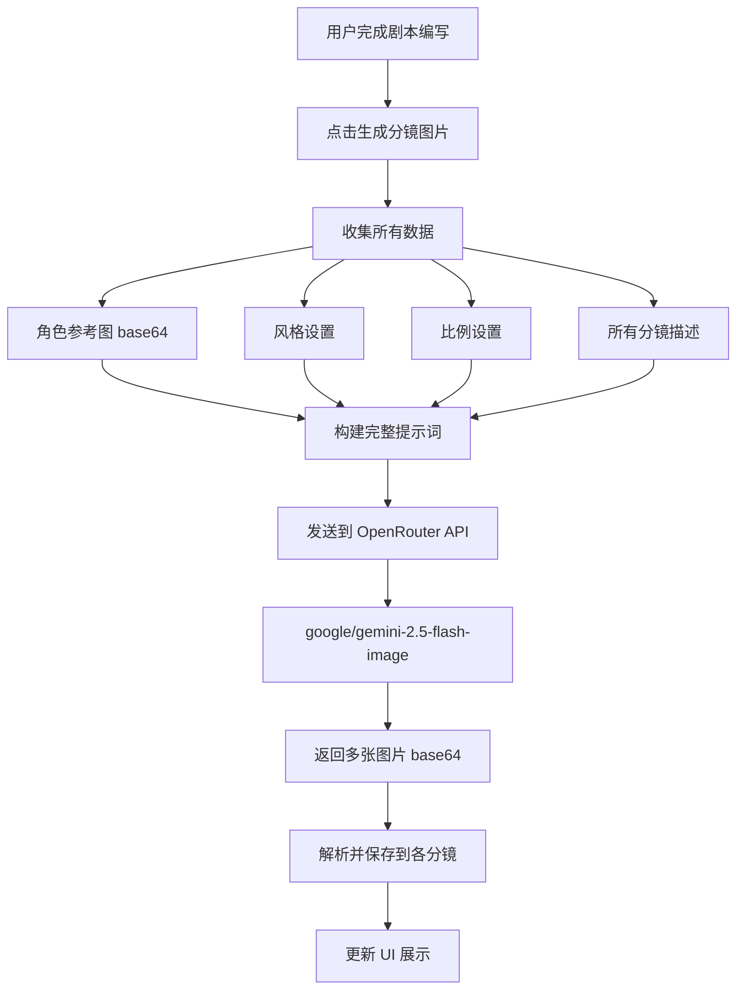

# 分镜图片生成技术方案

## 需求理解

本文档描述分镜工具中两种不同的图片生成场景及其技术实现方案。

---

## 场景一:角色生成 (简单模式)

### 功能描述
为角色库中的单个角色生成参考图。

### 输入参数
- 角色名称
- 角色描述(外貌、年龄、服装等)
- 其他角色属性

### 实现方式
```javascript
// 直接将角色参数转换为提示词发送
const prompt = `${角色名称},${角色描述},${年龄},${服装}...`;
```

### API 调用
- 一次 API 调用生成一张图片
- 参数简单,直接传递

---

## 场景二:剧本分镜生成 (批量模式)

### 核心需求
**一次性生成整个剧本的所有分镜图片**,而非逐张生成。

### 为什么要批量生成?

#### 1. **人物一致性**
- 同一角色在不同分镜中的外貌必须保持一致
- 发型、服装、年龄特征等细节统一

#### 2. **场景一致性**  
- 同一场景在多个分镜中的背景、光线、环境保持连贯
- 时间线的视觉呈现连续

#### 3. **剧情连贯性**
- 分镜之间的动作、表情、位置关系自然过渡
- 整体叙事流畅

### 需要发送的信息

#### 输入数据结构
```javascript
{
  // 1. 人物参考图(已生成的角色图片)
  "characters": [
    {
      "name": "角色A",
      "referenceImage": "base64_image_data...",
      "description": "详细描述..."
    },
    {
      "name": "角色B", 
      "referenceImage": "base64_image_data...",
      "description": "详细描述..."
    }
  ],
  
  // 2. 全局风格设置
  "style": "写实风格 / 动漫风格 / 水彩风格...",
  
  // 3. 图片比例
  "aspectRatio": "16:9 / 9:16 / 1:1...",
  
  // 4. 所有分镜内容
  "storyboards": [
    {
      "shotNumber": 1,
      "scene": "场景描述",
      "characters": ["角色A", "角色B"],
      "action": "画面内容和动作描述",
      "camera": "镜头运镜说明"
    },
    {
      "shotNumber": 2,
      "scene": "场景描述",
      "characters": ["角色A"],
      "action": "画面内容和动作描述",
      "camera": "镜头运镜说明"
    }
    // ... 更多分镜
  ]
}
```

---

## 技术实现方案

### 方案 A: 单次 API 调用(推荐)

#### 构建超级提示词
将所有信息整合成一个完整的提示词:

```
你是专业的分镜画师,请根据以下信息生成完整的分镜序列:

【人物设定】
1. 角色A: [参考图] + 详细描述
2. 角色B: [参考图] + 详细描述

【风格要求】
- 整体风格: 写实摄影
- 画面比例: 16:9
- 保持人物和场景的一致性

【分镜列表】
第1镜: 
- 场景: 海滩日落
- 人物: 角色A, 角色B
- 画面: 两人牵手走在沙滩上,背景是橘红色夕阳...

第2镜:
- 场景: 海滩日落(特写)
- 人物: 角色A
- 画面: 角色A回头微笑的特写镜头...

[... 所有分镜内容]

请生成 N 张图片,每张对应一个分镜场景。
```

#### 优点
- 模型能理解整体剧情
- 自动保持一致性
- 减少 API 调用次数

#### 缺点  
- 单次调用成本较高
- 可能受到 token 限制

---

### 方案 B: 批量调用 + 一致性指令

每个分镜单独调用,但携带全局上下文:

```javascript
// 为每个分镜构建提示词
for (let shot of storyboards) {
  const prompt = `
    [全局设定]
    - 人物参考: 角色A(图片), 角色B(图片)
    - 风格: ${globalStyle}
    - 之前的分镜: [第1镜截图, 第2镜截图...]
    
    [当前分镜]
    - 第${shot.number}镜
    - ${shot.description}
    
    请保持与之前分镜的人物和风格一致性。
  `;
  
  await generateImage(prompt);
}
```

#### 优点
- 更精细的控制
- 可以逐步调整

#### 缺点
- API 调用次数多
- 成本高
- 一致性依赖模型理解

---

## 数据流程



---

## API 调用示例

### 请求格式
```javascript
const response = await fetch('https://openrouter.ai/api/v1/chat/completions', {
  method: 'POST',
  headers: {
    'Authorization': `Bearer ${API_KEY}`,
    'Content-Type': 'application/json'
  },
  body: JSON.stringify({
    model: 'google/gemini-2.5-flash-image',
    messages: [
      {
        role: 'system',
        content: '你是专业的分镜画家...'
      },
      {
        role: 'user',
        content: [
          // 文本提示词
          { type: 'text', text: '完整的分镜需求...' },
          
          // 角色参考图
          { 
            type: 'image_url', 
            image_url: { url: `data:image/png;base64,${角色A图片}` }
          },
          { 
            type: 'image_url', 
            image_url: { url: `data:image/png;base64,${角色B图片}` }
          }
        ]
      }
    ]
  })
});
```

### 响应处理
```javascript
const data = await response.json();

// 从响应中提取图片
const images = data.choices[0].message.images || [];

// 将图片分配到对应的分镜
storyboards.forEach((shot, index) => {
  if (images[index]) {
    shot.generatedImage = images[index].image_url.url;
  }
});
```

---

## 关键技术点

### 1. 图片上传
- 角色参考图需要转换为 base64
- 作为消息的一部分发送

### 2. 提示词工程
- 明确指定"生成 N 张图片"
- 强调"保持一致性"
- 详细描述每个分镜的区别

### 3. 结果映射
- API 返回的图片数组需要正确对应到分镜
- 建议在提示词中标注分镜编号

### 4. 错误处理
- Token 超限时的降级方案
- 生成失败时的重试机制
- 部分成功的处理

---

## 推荐实现

**建议采用方案 A(单次 API 调用)**,理由:

1. ✅ 最符合"保持一致性"的需求
2. ✅ 模型能看到完整剧情
3. ✅ 减少 API 调用成本
4. ✅ 实现相对简单

如果遇到 token 限制,可以:
- 分批处理(每 5-10 个分镜一组)
- 每批保持人物参考图和风格设置

---

## 下一步工作

1. [ ] 实现角色生成功能
2. [ ] 实现分镜批量生成功能  
3. [ ] 测试不同场景下的一致性
4. [ ] 优化提示词模板
5. [ ] 添加错误处理和重试机制
